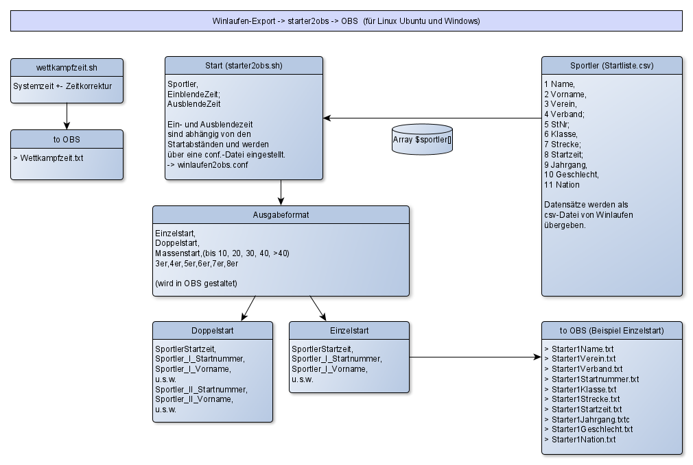

# winlaufen2obs
Die Skript wettkampfzeit.sh liefert eine formatierte Uhrzeit und speichert diese als Text in einer Textdatei.
Das Skript starter2obs.sh liest aus einer csv-Datei jeweils zur aktuellen Startzeit die Daten der gemeldeten Starter und gibt diese Daten als Textdateien aus.
Die Textdateien können dann in OBS zur Anzeige genutzt werden.  
## Beispiel

## Prinzipskizze

